# NepaliDatePicker — MAUI

A **Bikram Sambat (BS)** date picker for **.NET MAUI** built on a Material Design calendar grid. Supports bottom-sheet and dialog presentation, BS ↔ AD dual-calendar toggle, full Devanagari script rendering, and rich theming.

[](https://www.nuget.org/packages/NepaliDatePicker.Maui/)

---

## Preview

### Bottom Sheet — Light Theme

<table>
  <tr>
    <th>English (Purple)</th>
    <th>English (Teal)</th>
    <th>Nepali Script (Purple)</th>
    <th>Nepali Script (Teal)</th>
  </tr>
  <tr>
    <td>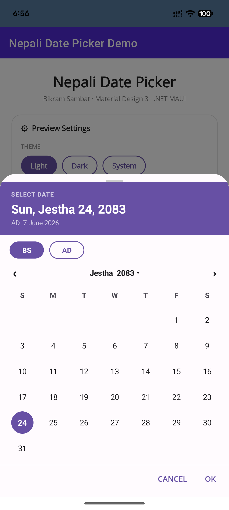</td>
    <td>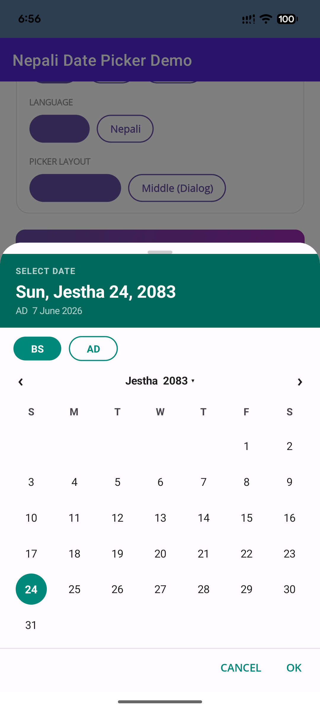</td>
    <td>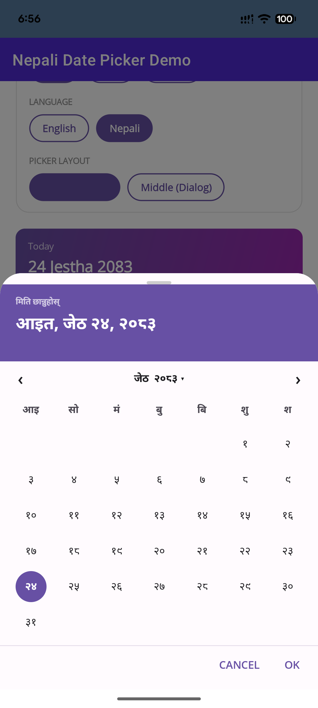</td>
    <td>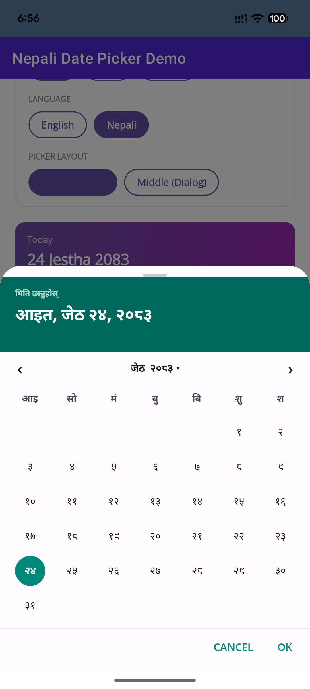</td>
  </tr>
</table>

### Dialog — Light & Dark Theme

<table>
  <tr>
    <th>Light (Purple)</th>
    <th>Light (Teal)</th>
    <th>Dark (Teal)</th>
  </tr>
  <tr>
    <td>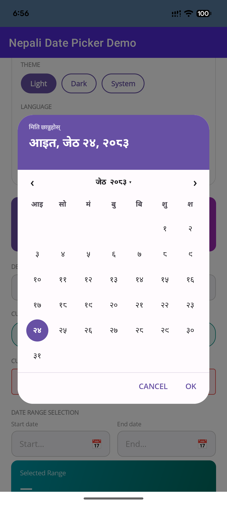</td>
    <td>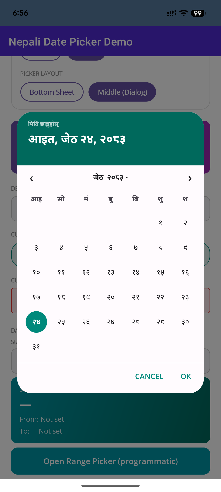</td>
    <td>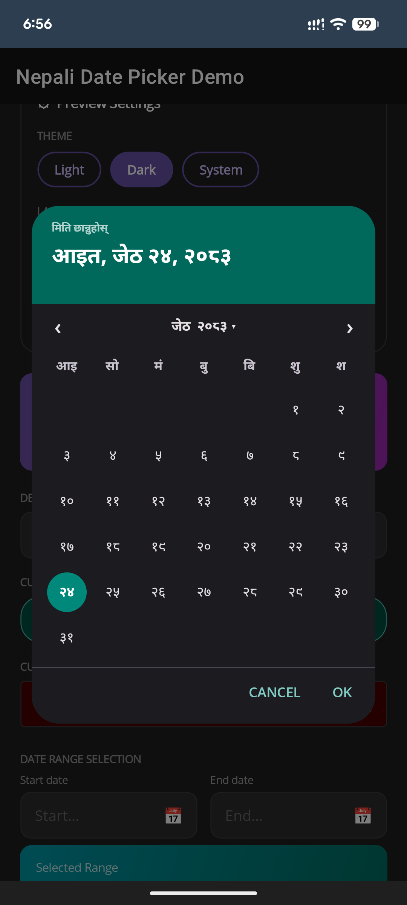</td>
  </tr>
</table>

### Year / Month Fast-Nav — Dark Theme

<table>
  <tr>
    <th>Purple Theme</th>
    <th>Teal Theme</th>
  </tr>
  <tr>
    <td>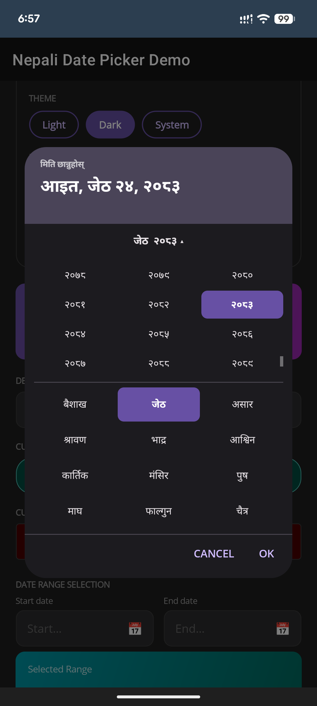</td>
    <td>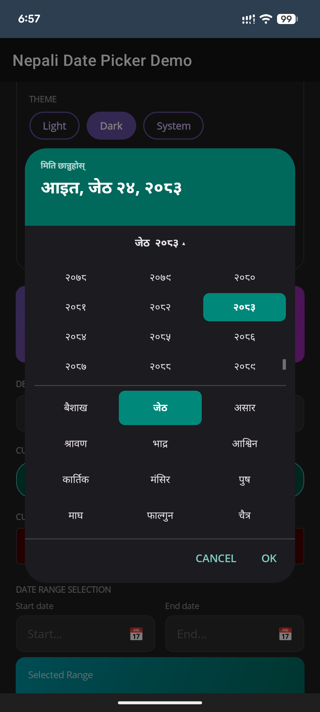</td>
  </tr>
</table>

### Wheel Style

<table>
  <tr>
    <th>Dark Theme</th>
    <th>Light Theme</th>
  </tr>
  <tr>
    <td>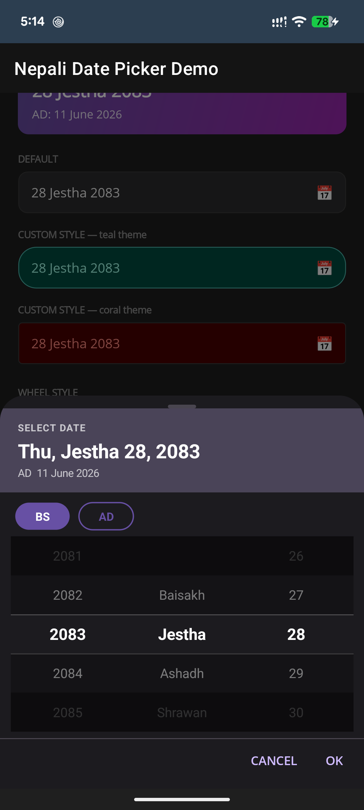</td>
    <td>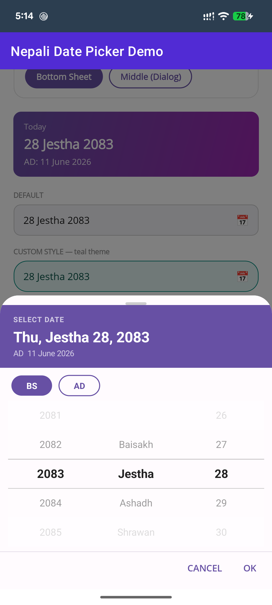</td>
  </tr>
</table>

### Input Style

<table>
  <tr>
    <th>Dark Theme</th>
    <th>Light Theme</th>
  </tr>
  <tr>
    <td>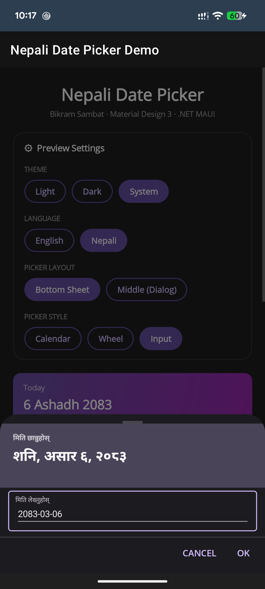</td>
    <td>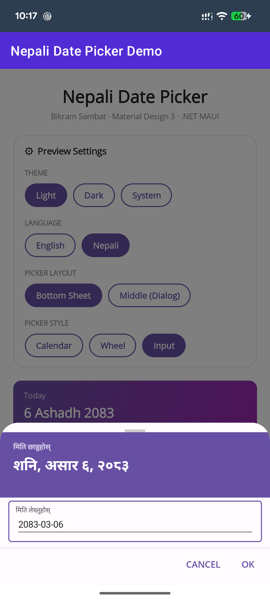</td>
  </tr>
</table>

---

## Features

| Feature | Details |
|---|---|
| **Material Design calendar** | Month grid with today highlight, selected-day fill, and smooth navigation |
| **Dual presentation** | Bottom sheet (slide-up) or centered dialog (fade + scale) |
| **BS / AD toggle** | Chip switch lets users pick in Bikram Sambat or Gregorian; live header updates |
| **Devanagari script** | Month names, day/year numerals, weekday labels all render in Nepali script |
| **Light & dark theme** | All surfaces and text use `SetAppThemeColor`; follows system appearance |
| **Year / month fast-nav** | Tap the month–year label to open a scrollable year + month grid |
| **Auto day clamping** | BS months vary 29–32 days; changing year or month re-clamps the selected day |
| **BS year range** | 1970 – 2100 BS (official Government of Nepal calendar data) |
| **Drop-in XAML control** | `<nep:NepaliDatePicker>` — bind `SelectedDate`, done |
| **DI / MVVM service** | `INepaliDatePickerService` registered via `AddNepaliDatePicker()` |
| **Full theming** | Primary color, header, surface, text — every MD3 token is overridable |

---

## Installation

```csharp
// MauiProgram.cs
builder.AddNepaliDatePicker();
```

Add the XAML namespace where needed:

```xml
xmlns:nep="clr-namespace:NepaliDatePicker.Controls;assembly=NepaliDatePicker.Maui"
```

---

## Usage

### Drop-in XAML control

```xml
<nep:NepaliDatePicker
    SelectedDate="{Binding MyDate}"
    Placeholder="Pick a date…"
    Format="d MMMM yyyy"
    DisplayMode="Both"
    UseNepaliScript="False"
    DateSelected="OnDateSelected" />
```

### Wheel picker style

Set `PickerStyle="Wheel"` to swap the calendar grid for three iOS-style drum-roll
wheels (year | month | day).

```xml
<nep:NepaliDatePicker
    SelectedDate="{Binding MyDate}"
    PickerStyle="Wheel"
    UseNepaliScript="True"
    DateSelected="OnDateSelected" />
```

### Programmatic / MVVM

```csharp
// Inject INepaliDatePickerService
public MyViewModel(INepaliDatePickerService picker) => _picker = picker;

[RelayCommand]
async Task OpenPicker()
{
    var opts = new NepaliDatePickerOptions
    {
        DisplayMode     = DateDisplayMode.Both,
        Presentation    = PickerPresentation.BottomSheet,
        UseNepaliScript = false,
    };
    NepaliDate? result = await _picker.ShowAsync(SelectedDate, opts);
    if (result is not null)
        SelectedDate = result;
}
```

---

## `NepaliDatePicker` control

### Core

| Property | Type | Default | Description |
|---|---|---|---|
| `SelectedDate` | `NepaliDate?` | `null` | Two-way bindable selected date |
| `Placeholder` | `string` | `"Select Date"` | Text shown when no date is selected |
| `Format` | `string` | `"d MMMM yyyy"` | Format tokens: `d` `dd` `M` `MM` `MMMM` `yy` `yyyy` |
| `IsReadOnly` | `bool` | `false` | Prevents the picker from opening |

### Picker behaviour

| Property | Type | Default | Description |
|---|---|---|---|
| `DisplayMode` | `DateDisplayMode` | `Both` | Which calendar system(s) the picker exposes |
| `Presentation` | `PickerPresentation` | `BottomSheet` | Bottom sheet or centered dialog |
| `PickerStyle` | `PickerStyle` | `Calendar` | MD3 calendar grid or iOS-style drum wheels |
| `UseNepaliScript` | `bool` | `false` | Render BS dates in Devanagari script |

### Picker theming

| Property | Type | Default | Description |
|---|---|---|---|
| `PrimaryColor` | `Color?` | MD3 purple | Selected day fill, active chip, today outline |
| `PrimaryColorDark` | `Color?` | `PrimaryColor` | Dark-theme override |
| `PickerHeaderColor` | `Color?` | MD3 purple | Header band background color |
| `PickerFontFamily` | `string?` | `null` | Custom font for all text inside the picker |

### Button appearance

| Property | Type | Default | Description |
|---|---|---|---|
| `BorderColor` | `Color` | `#C8C8C8` | Input field border (light theme) |
| `BorderColorDark` | `Color` | `#3A3A3A` | Input field border (dark theme) |
| `InputBackgroundColor` | `Color` | `#F2F2F7` | Input field fill (light theme) |
| `InputBackgroundColorDark` | `Color` | `#2C2C2E` | Input field fill (dark theme) |
| `TextColor` | `Color` | `#111111` | Date text color (light theme) |
| `TextColorDark` | `Color` | `#EEEEEE` | Date text color (dark theme) |
| `PlaceholderColor` | `Color` | `#AAAAAA` | Placeholder text color (light theme) |
| `PlaceholderColorDark` | `Color` | `#666666` | Placeholder text color (dark theme) |
| `FontFamily` | `string?` | `null` | Font for the date / placeholder label |
| `FontSize` | `double` | `15.0` | Font size of the date / placeholder label |
| `CornerRadius` | `double` | `10.0` | Corner radius of the input field border |
| `CalendarIcon` | `string` | `"📅"` | Icon shown on the right side of the field |

### Event

| Event | Signature | Fires when |
|---|---|---|
| `DateSelected` | `EventHandler<NepaliDate?>` | User confirms a date in the picker |

---

## `NepaliDatePickerOptions`

Passed to `INepaliDatePickerService.ShowAsync()` for programmatic control.

### Behaviour

| Property | Type | Default | Description |
|---|---|---|---|
| `DisplayMode` | `DateDisplayMode` | `Both` | `BsOnly`, `AdOnly`, or `Both` |
| `Presentation` | `PickerPresentation` | `BottomSheet` | `BottomSheet` or `Dialog` |
| `PickerStyle` | `PickerStyle` | `Calendar` | `Calendar` grid or iOS-style `Wheel` |
| `UseNepaliScript` | `bool` | `false` | All BS text in Devanagari script |
| `SheetCornerRadius` | `double` | `28` | Top-corner radius of the sheet |
| `FontFamily` | `string?` | `null` | Custom font family |

### Full palette

| Property | Affects |
|---|---|
| `PrimaryColor` / `PrimaryColorDark` | Selected day fill, active chip, today ring, OK button text |
| `OnPrimaryColor` | Text/icon on the primary-filled surface |
| `HeaderBackgroundColor` / `HeaderBackgroundColorDark` | Colored header band |
| `HeaderTextColor` | All text inside the header band |
| `SurfaceColor` / `SurfaceColorDark` | Picker body background |
| `OnSurfaceColor` / `OnSurfaceColorDark` | Day numbers, month/year label |
| `OnSurfaceVariantColor` / `OnSurfaceVariantColorDark` | Day-of-week header initials |

---

## `DateDisplayMode` enum

| Value | Behaviour |
|---|---|
| `Both` *(default)* | Shows a BS / AD chip toggle |
| `BsOnly` | Only Bikram Sambat; chip toggle hidden |
| `AdOnly` | Only Gregorian; chip toggle hidden |

---

## `PickerPresentation` enum

| Value | Behaviour |
|---|---|
| `BottomSheet` *(default)* | Sheet slides up from the bottom |
| `Dialog` | Floats centered with fade + scale animation |

---

## `PickerStyle` enum

| Value | Behaviour |
|---|---|
| `Calendar` *(default)* | MD3 month grid with year/month tap-to-jump |
| `Wheel` | Three drum-roll wheels (year \| month \| day) |

---

## Nepali script mode

When `UseNepaliScript = true`:

- Month names: "Baisakh" → "बैशाख"
- Day numbers: 1–32 → १–३२
- Year: 2082 → २०८२
- Weekday headers: S M T W T F S → आइ सो मं बु बि शु श
- Header date: "Sun, Baisakh 5, 2082" → "आइत, बैशाख ५, २०८२"

---

## Project layout

```
src/maui/                              ← MAUI NuGet library
│  MauiAppBuilderExtensions.cs
│  NepaliDatePickerPage.cs
│  NepaliDatePickerService.cs
│
├─ Controls/
│   NepaliDatePickerSheet.cs
│   NepaliDatePickerButton.cs
│   DrumRollPicker.cs
│
├─ Models/
│   NepaliDate.cs
│   NepaliDatePickerOptions.cs
│
└─ Services/
    BsAdConverter.cs
    INepaliDatePickerService.cs

example/maui/                          ← demo MAUI app
   MainPage.xaml
   UtilsPage.xaml
   CalendarPage.xaml
```

---

## License

MIT
